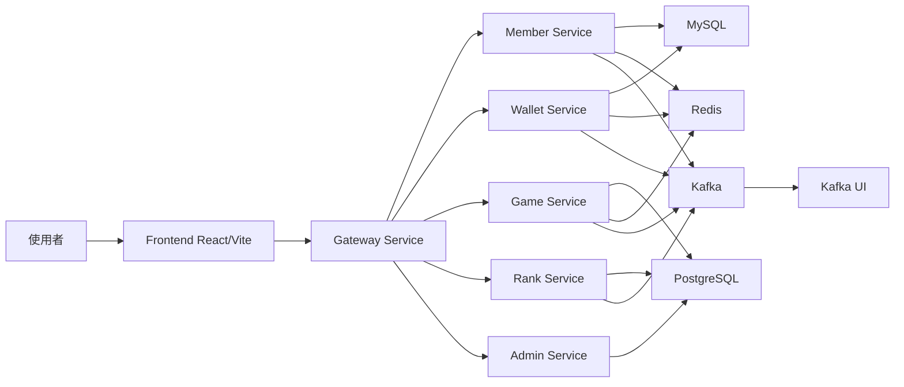

# Lucky Star Casino 專案基底功能說明

這份文件說明目前專案基底已經提供什麼、各資料夾代表什麼，以及整個系統預計怎麼運作。

## 目前專案在做什麼

Lucky Star Casino 是一個「模擬幣」線上娛樂遊戲平台的專案骨架。它的定位不是金錢交易系統，而是提供會員、錢包、遊戲、排行榜與後台管理等功能的社交娛樂平台基底。

目前 repo 主要完成的是基礎設施層：

- 使用 Docker Compose 一次啟動開發環境需要的服務。
- 建立 MySQL 與 PostgreSQL 資料庫容器。
- 建立 Redis 容器，預留給快取、短期狀態或 session 使用。
- 建立 Kafka 與 Kafka UI，預留給服務之間的事件流。
- 自動建立平台會用到的 Kafka topics。
- 預留前端與多個後端微服務的資料夾結構。

換句話說，這個專案目前比較像是「可啟動的系統底座」，還不是已完成的產品功能。

## 整體架構概念



上圖是此專案基底預計支援的運作方式。實際程式碼尚未建立，但資料夾與基礎設施已經先把未來的服務邊界畫出來。

## 資料夾用途

| 路徑 | 用途 |
| --- | --- |
| `frontend/` | 預留給 React + Vite 前端。未來會放使用者介面、路由、API 串接、狀態管理。 |
| `backend/gateway-service/` | 預留給 API Gateway。未來負責統一入口、路由轉發、驗證與跨服務請求控管。 |
| `backend/member-service/` | 預留給會員服務。未來負責註冊、登入、會員資料與身分驗證相關邏輯。 |
| `backend/wallet-service/` | 預留給錢包服務。未來負責模擬幣餘額、扣款、加款與交易紀錄。 |
| `backend/game-service/` | 預留給遊戲服務。未來負責遊戲流程、下注模擬、遊戲結果產生。 |
| `backend/rank-service/` | 預留給排行榜服務。未來負責排行計算、排行查詢與成績更新。 |
| `backend/admin-service/` | 預留給後台管理服務。未來負責營運、會員、遊戲與系統管理功能。 |
| `database/mysql/` | MySQL 初始化 SQL。 |
| `database/postgres/` | PostgreSQL 初始化 SQL。 |
| `kafka/` | Kafka topic 初始化腳本。 |
| `docs/` | 專案文件。 |

## Docker Compose 啟動的服務

目前 `docker-compose.yml` 會啟動以下容器：

| 服務 | 容器名稱 | 功能 |
| --- | --- | --- |
| `mysql` | `lucky-star-mysql` | MySQL 8.4，預留給關聯式業務資料。 |
| `postgres` | `lucky-star-postgres` | PostgreSQL 16，預留給另一組關聯式資料或服務資料。 |
| `redis` | `lucky-star-redis` | Redis 7，預留給快取、session、限流、短期狀態。 |
| `zookeeper` | `lucky-star-zookeeper` | Kafka 依賴的協調服務。 |
| `kafka` | `lucky-star-kafka` | Kafka broker，負責事件訊息。 |
| `kafka-init` | `lucky-star-kafka-init` | 等 Kafka 健康後，自動建立 topics。 |
| `kafka-ui` | `lucky-star-kafka-ui` | Kafka 管理介面，預設可從 `http://localhost:8085` 查看。 |

MySQL、PostgreSQL、Redis、Kafka 都有 healthcheck。這代表 Docker Compose 可以判斷服務是否真的可用，而不只是容器是否已啟動。

## 環境變數與本機 Port

`.env.example` 定義了本機開發環境的預設 port 與帳密。實際啟動前應複製成 `.env`：

```bash
cp .env.example .env
```

目前預設值包含：

| 服務 | 本機 port |
| --- | --- |
| MySQL | `3307` |
| PostgreSQL | `5433` |
| Redis | `6379` |
| Kafka | `9092` |
| Kafka UI | `8085` |
| Frontend | `5173` |
| Gateway | `8080` |
| Member Service | `8081` |
| Wallet Service | `8082` |
| Game Service | `8083` |
| Rank Service | `8084` |
| Admin Service | `8086` |

## 資料庫目前初始化了什麼

### MySQL（`database/mysql/init.sql`）

| 資料表 | 所屬服務 | 說明 |
| --- | --- | --- |
| `system_health_check` | 基礎建設 | 確認資料庫初始化流程正常，各 Service 可寫入健康狀態 |
| `members` | Member Service | 玩家帳號：帳號、信箱、密碼雜湊、暱稱、頭像、角色、狀態 |

#### `members` 資料表欄位說明

| 欄位 | 型別 | 說明 |
| --- | --- | --- |
| `id` | BIGINT AUTO_INCREMENT | 玩家主鍵（playerId） |
| `username` | VARCHAR(50) UNIQUE | 登入帳號 |
| `email` | VARCHAR(100) UNIQUE | 電子信箱 |
| `password_hash` | VARCHAR(255) | BCrypt 雜湊密碼，不儲存明文 |
| `nickname` | VARCHAR(50) | 顯示暱稱，可由玩家更新 |
| `avatar` | TEXT NULL | 頭像：`https://` URL 或 `data:image/...;base64,...` |
| `role` | ENUM('PLAYER','ADMIN') | 預設 PLAYER |
| `status` | ENUM('ACTIVE','DISABLED') | 停權時設為 DISABLED |
| `created_at` | DATETIME | 建立時間 |
| `updated_at` | DATETIME ON UPDATE | 最後更新時間（自動維護） |

### PostgreSQL（`database/postgres/init.sql`）

| 資料表 | 所屬服務 | 說明 |
| --- | --- | --- |
| `system_health_check` | 基礎建設 | 同 MySQL 版本，確認初始化流程正常 |

> 錢包、遊戲、排行榜、後台等 PostgreSQL 資料表尚未建立，待各服務開發時補充。

需要注意的是，Docker 的資料庫初始化 SQL 只會在 volume 第一次建立時執行。如果已經啟動過容器，後續修改 init SQL 不會自動重跑。若要重新初始化本機資料庫，需要先刪除 volume：

```bash
docker-compose down -v
docker-compose up -d
```

執行前要確認本機資料可以被清掉。

## Kafka Topics 的用途

`kafka/kafka-init.sh` 會自動建立以下 topics：

| Topic | 預計用途 |
| --- | --- |
| `member.registered` | 會員註冊完成事件。可供錢包服務建立初始錢包、通知服務推送歡迎訊息。 |
| `wallet.debit` | 錢包扣款事件。可用在遊戲下注、消費模擬幣等情境。 |
| `wallet.credit` | 錢包加款事件。可用在遊戲獎勵、活動贈幣等情境。 |
| `game.result` | 遊戲結果事件。可供錢包結算、排行榜更新、後台統計使用。 |
| `rank.update` | 排行榜更新事件。可供前端或通知功能取得最新排行狀態。 |
| `notification.push` | 通知推送事件。預留給站內通知或其他提醒流程。 |

每個 topic 目前設定為：

- replication factor：`1`
- partitions：`3`

這適合本機開發環境。正式環境通常會需要更高的 replication factor，並依照流量調整 partitions。

## 預期的基本流程

以下是一個未來會員玩遊戲的可能流程：

1. 使用者透過前端註冊或登入。
2. 前端請求 Gateway。
3. Gateway 將會員相關請求轉給 Member Service。
4. 會員註冊完成後，Member Service 發出 `member.registered` 事件。
5. Wallet Service 收到事件後建立初始錢包。
6. 使用者開始遊戲時，Game Service 發起遊戲流程。
7. Wallet Service 根據遊戲需求處理 `wallet.debit` 或 `wallet.credit`。
8. Game Service 產生 `game.result` 事件。
9. Rank Service 根據遊戲結果更新排行榜，並發出 `rank.update`。
10. Notification 相關流程可透過 `notification.push` 發送提醒。

這些目前是架構預留與 topic 設計，尚未有實際後端服務程式碼。

## 目前已完成與尚未完成

已完成：

- 專案目錄骨架。
- Docker Compose 基礎服務。
- MySQL、PostgreSQL、Redis、Kafka、Kafka UI。
- Kafka topic 自動建立流程。
- 資料庫基本初始化表（`system_health_check`）。
- MySQL `members` 資料表 schema（`database/mysql/init.sql`）。
- `.env.example` 本機開發設定。

尚未完成：

- React 前端實作。
- Spring Boot 後端服務實作。
- API Gateway 路由設定。
- 會員、錢包、遊戲、排行榜、後台的 API。
- 錢包、遊戲、排行榜、後台等 PostgreSQL 資料表 schema。
- 認證與授權。
- 測試、CI/CD、正式環境部署設定。

## 一句話總結

這個專案現在的功能，是先把「線上模擬幣娛樂平台」會需要的開發底座架好：資料庫、快取、事件系統、服務資料夾與本機啟動方式都已經準備好；真正的前後端業務功能還在待實作階段。
